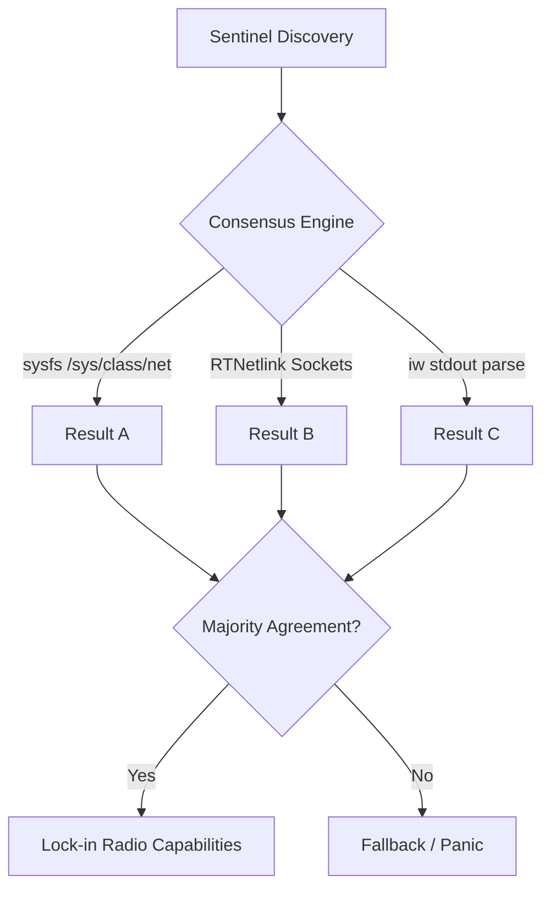

# Airspace Sentinel: Professional Wireless IDS Architecture Plan

> [!IMPORTANT]
> Planning/checkpoint document. Phase markers in this file reflect the plan state at the time of writing and are not a live status feed.

## Core Philosophy

This document outlines the professional, enterprise-grade architecture for Bastion's new **Airspace Sentinel**. Based on intensive design sessions, the architecture strictly adheres to:

1. **Hardware-Agnostic Genericism**: Bastion will run on *any* capable Wi-Fi hardware, not just a specific vendor's USB dongle.
2. **"Carbon Dating" Validation**: Absolute certainty through cross-validation. No single point of failure when determining system capabilities.
3. **Strict Separation of Concerns (SoC) & Loose Coupling**.
4. **Fixture-Driven TDD & Sandbox Testing**: No "half-stepping" straight to the main daemon.

---

## 1. Hardware Abstraction & The "Carbon Dating" Engine

Hardware discovery must be entirely completely decoupled from the main firewall daemon.

### The Universal Trait (Genericism)

We will define a universal `RadioDevice` Trait in Rust. This ensures the Sentinel logic remains completely ignorant of whether it is communicating with an Intel PCIe card, an Atheros USB adapter, or a simulated Mock device.

- The Trait defines rules: `supports_monitor_mode()`, `enable_monitor()`, `read_telemetry()`.

### The Consensus Engine

To prevent parsing failures or driver quirks from breaking Bastion, hardware validation will employ a "Carbon Dating" consensus model:

- Internally query `sysfs` (`/sys/class/net`).
- Internally query kernel `RTNetlink` sockets.
- Execute sub-processes like `iw` and parse their stdout.
*Result: If the majority of validation methods agree, Bastion definitively locks in the capability.*

---

## 2. Implementation Phasing

### Phase 1: Alpha Step - Fixture-Driven TDD (✅ COMPLETED)

**Location:** `utils/src/net/wifi.rs` and `utils/src/net/wifi_test.rs`

1. **Unit Mocks (Contract Testing):** The user specified that *tests must compensate for the genericism*. We will write "Contract Tests" that prove the generic `RadioDevice` interface behaves perfectly no matter what concrete struct implements it.
2. **Real-World Fixtures:** Tests will be fed actual, raw `iw` text dumps, malformed JSON, and truncated hex data to guarantee parser resilience.

**Location:** `utils/tests/live_wifi_tests.rs`
3. **Live Hardware Integration (HIL):** Isolated tests that directly query the physical USB adapter (`wlxc01c304321d7`) safely using thread locks.

### Phase 2: Beta Step - The Forge Sandbox (✅ COMPLETED)

**Location:** `utils/src/bin/bastion.rs`, `utils/src/ui/dashboard.rs`
We successfully built and integrated the TUI sandbox into the main orchestrator (`bastion.rs`), completely decoupling the hardware sniffing from the visual representation.

1. **~~The Generic TUI~~ (✅ COMPLETED):** A standalone, thread-safe asynchronous rendering engine powered by native terminal graphic crates and concurrent channels.
2. **~~The Sandbox Pipeline~~ (✅ COMPLETED):** Successfully implemented robust `Ctrl+C` teardown, hardware OS boundaries, and a live FoxHunter matrix.

### Phase 3: Tactical Interactivity & Data Ingestion (✅ COMPLETED)

**Location:** `utils/src/ui/components/` & `utils/src/io/`

1. **Enterprise-Grade Interactive Matrix (Decoupled):** We will build a completely generic, reusable `InteractiveTable<T>` state machine. This ensures that *any* future module (Bluetooth scanning, ARP tables, firewall logs) can use our beautiful matrix UI with built-in Up/Down scrolling, without writing custom UI code.
2. **Live Target Lock-On:** Integrating the Interactive Matrix into `bastion.rs` so the user can scroll through live Wi-Fi targets and press `Enter` to lock on for active Deauth strikes.
3. **Offline Target Payload (CSV Ingestion):** Using `serde`, we will build an ingestion engine that allows Bastion to read a previously saved `bastion_capture.csv` file, automatically hunting and striking targets on a pre-defined hitlist when they appear in the airspace.

### Phase 4: Concrete Daemon Integration (✅ COMPLETED)

**Location:** `daemon/src/main.rs` & `ebpf/src/sentinel.rs`
Once the Alpha and Beta phases prove the data collection and interface engines are flawless:

1. Wire the `--enable-sentinel [wlan_interface]` flag into Bastion.
2. Route the physical OS radiotap rings through the standard channels and into our generic interactive UI.

---

## 3. Key Decisions & Rationale

- **Why Custom Asynchronous UI Engines?** Prevents terminal redraw corruption and window resize bugs found in legacy wireless scanning tools, plus gives us an exclusively customized, multi-colored, grid-capable universal output format that we control from end-to-end for atomic, readable info dumps.
- **Why Separate Sandbox?** Guarantees that any panic in the new Wi-Fi logic during development cannot crash the master production firewall daemon.
- **Why Hardware Threading Channels?** Ensures that high-speed packet ingestion (Producer) never blocks the UI thread's render cycle (Consumer).

---
&copy; 2026. All Rights Reserved. This project is proprietary and closed-source.
