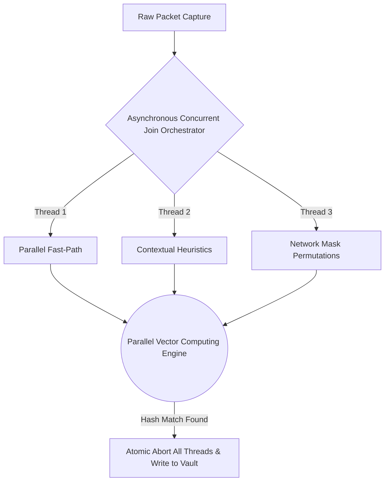

# Bastion Architecture: The "Trinity" Pattern

Bastion operates under a strict separation of concerns, heavily prioritizing maximum throughput for network traffic while safely handling rule mutations from external applications.

## ⚡ 1. The Kernel Data Plane (Hot Path)

The true heart of Bastion lies within its hardware-level packet interception. Instead of passing massive amounts of network traffic all the way up to user space (causing expensive context switches), Bastion injects instructions directly into the host operating system kernel's network queue via **in-kernel virtual machine bytecode and fast packet path hooks**.

The Data Plane holds one ironclad rule: **Zero Memory Allocations and Zero Mutex Locks.**

- **O(1) Map Hash Lookups**: We utilize a shared kernel-space hash map. Memory pointers are synchronized flawlessly so native packets are dropped instantly before they ever reach the system firewall.
- **🔮 Flawless Endianness Translation**: In networking, packet bytes arrive in "Big Endian" format (Network Byte Order), but your physical server CPU calculates in "Little Endian". We dynamically parse and map IPs utilizing exact bitwise native representations (`u32::from_ne_bytes`), meaning the kernel rules and the user-space daemon share absolute memory layout parity and drop traffic flawlessly.
- **IPv4-Mapped IPv6 Defense**: Automatically detects and drops IPv4-mapped IPv6 connections if the underlying IPv4 address is blocked.

## 🧠 2. The Control Plane (User-Space Daemon)

The Control Plane sits safely above the kernel-space. This runs the Master Daemon and orchestrates all configurations.

- **Dual-Phase Compilation Arsenal 🛠️**: Constructing the Daemon involves compiling two separate architectures seamlessly. A specialized compilation target compiles the raw data plane, transforming our systems programming logic into portable intermediate bytecode. Our intelligent build script orchestrates this complex linking process before assembling the overarching executable binary!
- **Read-Copy-Update (RCU)**: Employs a lock-free pointer swapper to facilitate atomic pointer swaps.
- When an API wants to update the rules, it clones the current state, mutates it, and swaps the pointer.
- Packets in-flight complete using the old pointer, while new packets effortlessly latch onto the new pointer. This prevents a large rule update from freezing active network connections.

## 🌉 3. The API Frontier

Bastion supports highly granular Layer 3 (IP/CIDR) and Layer 4 (TCP/UDP Port) blocks seamlessly across native boundaries.

Bastion is designed not to exist in a vacuum but as an ecosystem engine.

- **Daemon IPC 📡**: A background worker allowing standard inter-process communication natively directly into the hardware NIC buffers.
- **FFI Boundary 🧩**: Foreign Function Interface to export raw runtime capability to higher-level runtime environments and bridging interfaces.

## 💥 4. The Cryptographic Data Plane

To completely eliminate the bloat of external software emulation, Bastion features a bespoke, bare-metal parallel cryptographic pipeline.

- **Zero-Allocation Execution**: Prioritizes raw byte slices and core CPU instruction intrinsics to calculate verification hashes, bypassing OS context overhead.
- **Multi-Vector Asynchronous Join Orchestrator**: Instantiates completely isolated OS threads for Contextual Heuristics, Network Masking, and Statistical Permutations simultaneously.

---
&copy; 2026. All Rights Reserved. This project is proprietary and closed-source.
