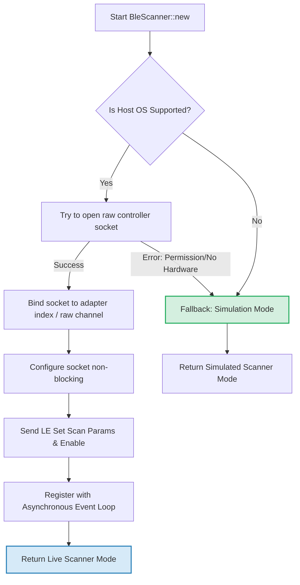
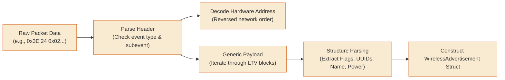
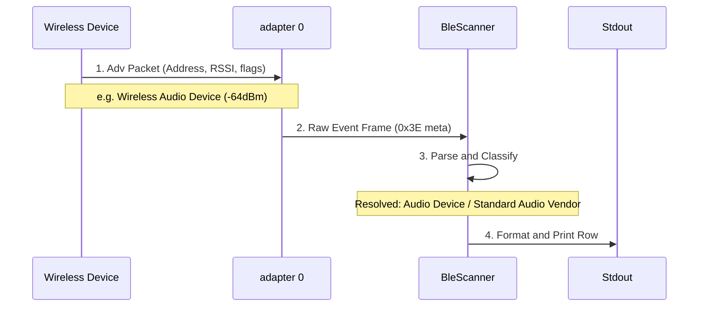
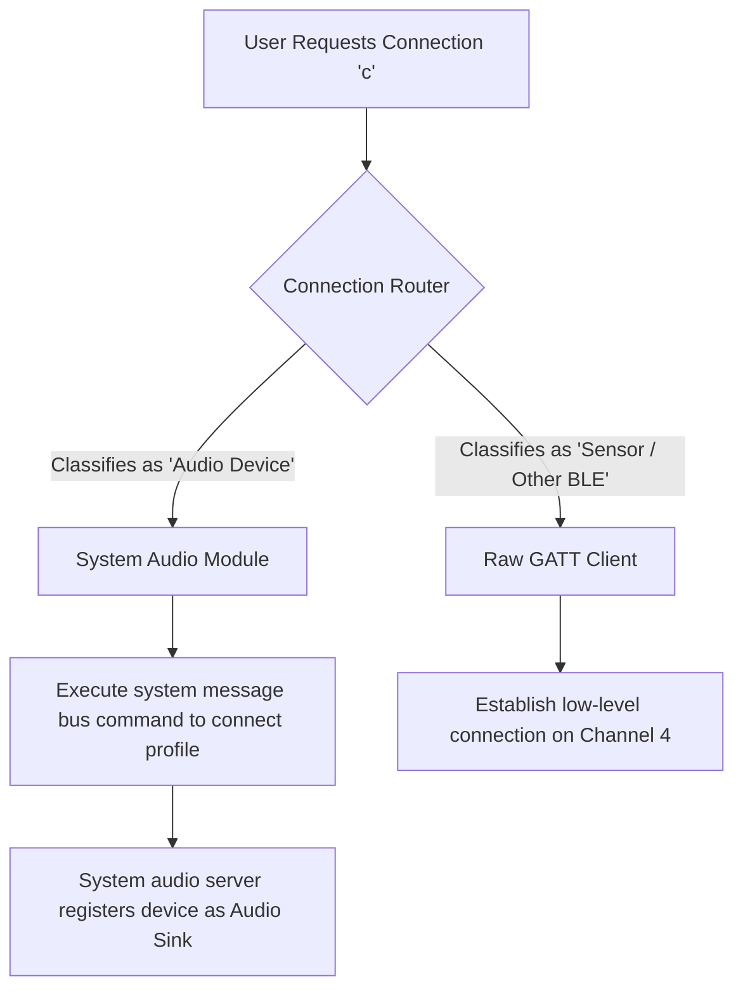

# Low-Energy Wireless Passive Scanning Subsystem

This document provides a comprehensive technical overview, architectural blueprint, and developer usage guide for the Passive Low-Energy Short-Range Wireless advertisement scanner and reporting engine implemented in `utils::net::ble` and `utils::net::ble_report`.

---

## 1. Architectural Design

The wireless scanner is designed on two core principles: **zero-overhead direct socket communication** when hardware/privileges are present, and **transparent high-fidelity simulation fallback** when running in restricted environments (such as restricted virtual containers, unsupported operating systems, or unprivileged command shells).

### Diagram: Initialization & Fallback Flow
* **High-Level Summary:** If executed under non-privileged shells, on unsupported operating systems, or in restricted container virtualizations, the scanner dynamically defaults to **Simulation Mode** (mock advertising frames) to ensure uninterrupted service operation.
* **Technical Mechanism:** System-level stubs automatically fall back to an internal asynchronous channel emitting mock advertisement structs, preserving identical public API signatures.



### Key Technical Specs:
* **Low-Level Controller Raw Sockets:** The live scanner communicates with the host controller directly over the host operating system's raw socket communication interface (raw socket type, family `31`, protocol `1`).
* **Controller Filters:** By default, low-level raw controller sockets suppress incoming events to prevent spamming user-space. We configure a custom C-aligned socket filter (socket option configuration level `0`, option `2` with 16-byte structure alignment) to instruct the kernel to pass low-energy metadata events (`0x3E`) while blocking background command noise.
* **Non-Blocking I/O:** Uses the asynchronous file descriptor polling utility to poll the raw socket's readability, yielding control back to the async executor when no advertisements are queued in the kernel ring buffer.

---

## 2. Telemetry Decoding Pipeline

The scanner consumes raw kernel frames (which have the transport headers stripped) and processes the low-energy metadata event frames.

### Diagram: Packet Decoding Pipeline
* **High-Level Summary:** Physical radio signals containing remote device metadata are captured by the wireless antenna and parsed into structured telemetry.
* **Technical Mechanism:** Processes a raw metadata event frame (`0x3E` Event Code, `0x02` Subevent), validates byte offsets, translates reversed network-order hardware addresses, and parses the Generic Profile structures payload utilizing length-type-value (LTV) structures.



1. **Metadata Event Validation:** Checks that the frame begins with event code `0x3E` (metadata event) and subevent code `0x02` (advertising report).
2. **Address Translation:** Extracts the 6-byte hardware address and reverses it to match standard Big-Endian representation (network order). Reads the address type byte to categorize as `Public` or `Random`.
3. **Generic Profile Structure Parsing:** Walks the payload using a length-type-value (LTV) offset loop to extract:
   * **Flags (`0x01`):** Advertisement attributes.
   * **Service UUIDs (`0x02` through `0x07`):** 16-bit, 32-bit, and 128-bit identifiers.
   * **Local Name (`0x08` / `0x09`):** Broadcast device identifiers.
   * **Tx Power Level (`0x0A`):** Transmission strength in dBm.
   * **Manufacturer Specific Data (`0xFF`):** Custom payloads matching a 16-bit manufacturer identifier.
4. **Connectability Detection:** Checks the `Event Type` byte. If it matches `ADV_IND` (`0x00`) or `ADV_DIRECT_IND` (`0x01`), the device is marked as `connectable: true` indicating it is open to incoming low-level attribute connections.

---

## 3. Data Enrichment Engine

Once an advertisement is parsed, the reporting utility enriches the telemetry with security-focused metadata. This makes target devices actionable for downstream penetration testing or observation logic:

| Feature | Source | Logic / Mechanism |
|---|---|---|
| **Vendor Mapping** | Hardware Address (OUI) / Manufacturer ID | If the address type is `Public`, resolves OUI prefix via a vendor prefix registry. If the address type is `Random` (privacy rotation), falls back to mapping the 16-bit manufacturer identifier (e.g., Vendor A `0x004C`, Vendor B `0x011A`, Vendor C `0x0058`). |
| **Wireless Service Attribute Profiles** | Service UUIDs | Map hexadecimal UUIDs to known profiles (e.g., `180F` -> `"Battery Service"`, `180D` -> `"Heart Rate"`, `FEED` -> `"Asset Tracker"`). |
| **Device Classification Heuristics** | Multi-source Signature | Heuristic categorization of device profile targets (e.g. `"Audio Device"`, `"Wearable / Fitness Tracker"`, `"Input Device (HID)"`, `"Location / Key Tracker"`). |

---

## 4. Adapter Discovery & Multi-Device Topography

In enterprise and diagnostic deployments, systems often host more than one wireless adapter. For example, a laptop may have a low-power built-in wireless chip, alongside one or more high-gain external USB wireless adapters optimized for long-range packet observation.

### Diagram: Multi-Device Topography
* **High-Level Summary:** The host operating system coordinates multiple physical wireless devices concurrently, permitting independent scanning or active client operations per adapter.
* **Technical Mechanism:** Parameterized device initialization enables parallel instantiation of multiple scanner loops bound to separate host hardware index handles (e.g., `adapter 0`, `adapter 1`).

```text
+-------------------------------------------------------------+
|                     Host Operating System                   |
|                                                             |
|   +-------------------+             +-------------------+   |
|   | Built-in Adapter  |             |  USB Wireless     |   |
|   |    Index: 0       |             |    Index: 1       |   |
|   |    Name: adapter 0|             |    Name: adapter 1|   |
|   +---------+---------+             +---------+---------+   |
|             |                                 |             |
+-------------v---------------------------------v-------------+
              | (Passive Scan)                  | (Active Scan)
              v                                 v
        Silent Monitoring               Target Connections
```

To support this cleanly without coupling socket execution directly to hardware configuration, we decoupled the interface detection layer into a single-purpose utility: `list_wireless_adapters() -> Vec<u16>`.

### The Interface Discovery Utility
This utility queries the kernel controller status path (`/sys/class/bluetooth/`) on supported host systems:
1. It scans the directory entries for subdirectories prefixed with the adapter prefix (`hci`).
2. It extracts the trailing numeric identifier (e.g. `hci0` -> `0`, `hci1` -> `1`).
3. It returns a sorted vector of available hardware IDs (e.g. `[0, 1]`).
4. On non-supported host environments (or if no wireless devices exist), it yields an empty list (`[]`) without crashing, allowing simulation mode to handle default device orchestration.

By executing this check *before* instantiating scanners, downstream logic can dynamically select, load-balance, or concurrent-scan across all available devices.

---

## 5. CSV & JSON Telemetry Formats

Exporting is done via the reporting module and written **atomically** (via temporary files) to defend against corruption during crashes or high-frequency writes.

### CSV Schema
A flat, simple format designed for spreadsheet imports:
```csv
Hardware Address,Address Type,RSSI,Local Name,Connectable,Vendor,Device Type
AA:BB:CC:DD:EE:FF,Public,-64,Wireless Audio Device,true,Standard Audio Vendor,Audio Device
11:22:33:44:55:66,Random,-57,Telemetry-Beacon,true,Randomized/Privacy Address,Generic Wireless Device
```

### JSON Schema
A rich, nested telemetry envelope containing the complete state signature:
```json
{
  "report_type": "WirelessScanReport",
  "version": "1.0.0",
  "timestamp": "2026-06-18T00:38:50Z",
  "devices": [
    {
      "mac": "AA:BB:CC:DD:EE:FF",
      "address_type": "Public",
      "rssi": -64,
      "tx_power": null,
      "local_name": "Wireless Audio Device",
      "flags": 6,
      "company_id": 88,
      "manufacturer_data_hex": "1005791CD8C566",
      "service_uuids": [
        "0000110b-0000-1000-8000-00805f9b34fb"
      ],
      "resolved_services": [
        "Wireless Control"
      ],
      "connectable": true,
      "vendor": "Standard Audio Vendor",
      "device_type": "Audio Device",
      "last_seen": "2026-06-18T00:38:50Z"
    }
  ]
}
```

---

## 6. Exhaustive Usage Examples

### Example 1: Discover Adapters, Stream Discoveries, and Check Mode
This example discovers available wireless interfaces on the system, selects the first available adapter (falling back to `0`), instantiates the scanner, checks whether it is operating on live hardware or in simulation fallback, and displays incoming advertisements:

```rust
use utils::net::ble::{BleScanner, list_bluetooth_adapters};

// Utilizing the asynchronous task runtime executor
#[tokio::main]
async fn main() -> Result<(), Box<dyn std::error::Error>> {
    // 1. Discover available wireless hardware adapters dynamically
    let adapters = list_bluetooth_adapters();
    println!("[*] Discovered wireless adapters: {:?}", adapters);

    let target_device = adapters.first().copied().unwrap_or(0);
    println!("[*] Initializing scanner on adapter index {}...", target_device);

    // 2. Instantiate Scanner (automatically falls back to simulation if non-root/no device)
    let scanner = BleScanner::new(target_device)?;

    if scanner.is_simulated() {
        println!("[!] Hardware scanner failed to initialize. Operating in SIMULATED Mode.");
    } else {
        println!("[*] Live raw socket scanner successfully bound to adapter index {}.", target_device);
    }

    println!("[*] Streaming discoveries...");
    loop {
        // 3. Await next advertisement packet
        let adv = scanner.next_advertisement().await?;
        
        println!(
            "[{}] Address: {} | Name: {:?} | RSSI: {} | Connectable: {}",
            if scanner.is_simulated() { "SIM" } else { "LIVE" },
            adv.address,
            adv.local_name,
            adv.rssi,
            adv.connectable
        );
    }
}
```

### Example 2: Optional Exporter Utilities
This example shows how to collect discovered advertisements over a period and export them atomically to CSV and JSON files using the decoupled reporting module:

```rust
use std::path::Path;
use std::time::Duration;
use tokio::time::timeout;
use utils::net::ble::BleScanner;
use utils::net::ble_report::{save_ble_csv, save_ble_json};

async fn collect_and_export_telemetry() -> Result<(), Box<dyn std::error::Error>> {
    // Instantiate scanner on adapter index 0
    let scanner = BleScanner::new(0)?;
    let mut collected = Vec::new();

    println!("[*] Collecting advertisements for 5 seconds...");
    let run_scan = async {
        loop {
            if let Ok(adv) = scanner.next_advertisement().await {
                collected.push(adv);
            }
        }
    };

    // Run scanner for 5 seconds using the asynchronous timer
    let _ = timeout(Duration::from_secs(5), run_scan).await;
    println!("[*] Captured {} discoveries. Exporting reports...", collected.len());

    // 4. Atomically write CSV and JSON reports to disk
    let csv_path = Path::new("wireless_discoveries.csv");
    let json_path = Path::new("wireless_discoveries.json");

    save_ble_csv(csv_path, &collected)?;
    save_ble_json(json_path, &collected)?;

    println!("[+] CSV saved to: {}", csv_path.display());
    println!("[+] JSON saved to: {}", json_path.display());
    Ok(())
}
```

---

## 7. Diagnostic Execution & Interactive TUI

The diagnostic wireless scanner binary (`ble_scan`) features a premium, interactive split-screen Terminal User Interface (TUI) built using a terminal rendering engine and console backend. It is fully responsive and features asynchronous attribute connection resolution.

### CLI Arguments
```bash
Usage: ble_scan [OPTIONS]

Options:
  -d, --device <DEVICE>  Wireless adapter index (e.g., 0 for adapter 0). Auto-detects if omitted
  -a, --active           Run with active scanning (requests SCAN_RSP payloads for names)
      --csv <CSV>        Atomically write CSV reports to the specified path on exit
      --json <JSON>      Atomically write JSON reports to the specified path on exit
  -h, --help             Print help
  -V, --version          Print version
```

### Hotkeys & Shortcuts
* **`Up` / `Down` Arrow Keys**: Navigate through the list of discovered devices.
* **`c` Key**: Toggle connection status. If a connectable device is selected, this triggers an asynchronous connection using the active connection client to retrieve device attributes (Model Name, Battery level, and Heart Rate) in the background without blocking TUI drawing. Pressing `c` again disconnects the client.
* **`q` or `Esc` Keys**: Cleanly close raw/alternate terminal mode and exit the application (atomically exporting CSV/JSON reports if arguments were provided).

### Exhaustive Command Combinations Matrix

Execute these commands using the compiled binary file path `./target/release/ble_scan`:

* **Passive Scanning Only (Defaults)**:
  ```bash
  sudo ./target/release/ble_scan
  ```
  *Description*: Passive scan listening silently on the first resolved physical adapter index (e.g., `adapter 0`).

* **Active Scanning Only**:
  ```bash
  sudo ./target/release/ble_scan --active
  # or
  sudo ./target/release/ble_scan -a
  ```
  *Description*: Active scan issuing requests to fetch additional metadata (e.g., local name fields) in Scan Responses.

* **Target Specific Adapter**:
  ```bash
  sudo ./target/release/ble_scan --device 2
  # or
  sudo ./target/release/ble_scan -d 2
  ```
  *Description*: Binds the raw socket directly to interface index 2 (`adapter 2`).

* **Passive Scan + CSV Report**:
  ```bash
  sudo ./target/release/ble_scan --csv /tmp/report.csv
  ```
  *Description*: Passive scan exporting resolved devices telemetry to a formatted CSV spreadsheet on application exit.

* **Active Scan + JSON Report**:
  ```bash
  sudo ./target/release/ble_scan -a --json /tmp/report.json
  ```
  *Description*: Active scan exporting complete state details to an atomic JSON record on application exit.

* **Combined Command (Target Adapter + Active Scan + CSV & JSON Exports)**:
  ```bash
  sudo ./target/release/ble_scan -d 1 -a --csv /tmp/out.csv --json /tmp/out.json
  ```
  *Description*: Active scan on `adapter 1` yielding both JSON and CSV output files atomically upon exit.

* **Safe Simulated Fallback**:
  ```bash
  ./target/release/ble_scan
  ```
  *Description*: Running without elevated privileges or on host environments without hardware automatically kicks off the scanner in safe simulation mode. Excellent for client feature exploration.

### Display Unit Tests (TDD)
The display logic is fully validated via TDD unit tests built directly into the binary file. To run these tests:
```bash
cargo test --bin ble_scan
```
These tests verify:
1. **RSSI Sorting**: Discovered devices are sorted in descending order of signal strength.
2. **Address Tie-Breaker**: Devices with equal RSSI are sorted alphabetically by hardware address.
3. **Cursor Bound Clamping**: The selection cursor index remains within safe bounds when active devices are added or filtered out.

---

## 8. Real-World Outcomes & Operational Scenarios

When deploying the scanner in the field, operators should expect distinct behavioral patterns based on target devices:

### Scenario A: Live Console Stream
A successful live execution under root privileges yields a real-time, self-aligning table showing active signals in the airspace:

```text
[*] Initializing raw wireless scanner on adapter 0...
[*] Requires elevated privileges.
[*] Scanner active. Listening for advertisements (Ctrl+C to exit)...
Hardware Address               | RSSI  | Device Name               | Services  
-------------------------------------------------------------------------------------
AA:BB:CC:DD:EE:FF (Public)     | -64   | Wireless Audio Device     | 0000110b-0000-1000-8000-00805f9b34fb
11:22:33:44:55:66 (Random)     | -88   | <Unknown>                 | None
22:33:44:55:66:77 (Random)     | -42   | Smart Watch               | 7001
```

### Diagram: Advertisement Capture Flow
* **High-Level Summary:** A peripheral advertisement broadcast is captured by the interface adapter, resolved through the database mapping engine, and rendered in the diagnostic interface.
* **Technical Mechanism:** Raw advertising events are retrieved from the raw socket binding of the target device interface (`adapter 0`). The parser consumes the frame, decodes payload parameters, maps the Vendor prefix, and formats the output fields.



### Scenario B: Privacy Hardware Address Rotation
Privacy-centric peripheral devices rotate their hardware addresses approximately every 15 minutes for anti-tracking privacy. 
* **What to expect:** You will see new `Random` hardware addresses appear periodically.
* **The Smart Identifier:** Because the hardware manufacturer mapping checks the raw advertisement data *in addition* to the address, the scanning engine will successfully map these rotating addresses to `"Peripheral Vendor"` and classify the device category as `"Wearable / Fitness Tracker"` or `"Audio Device"` even as the hardware address rotates.

### Scenario C: Active vs. Passive Scan Discrepancy
Because this module acts as a passive raw observer, it binds to the incoming event queue of `adapter 0`. 
* **Behavior:** If the wireless adapter is idle, it will only capture periodic undirected advertising broadcasts. Device names (which are often transmitted as Scan Responses upon query) may be missing.
* **Operational Tip:** Running a discovery controller in the background (using the wireless configuration utility scan commands) forces the hardware to transmit scan requests. This triggers devices to send their Scan Responses, allowing the scanning engine to capture and resolve local device names instantly.

---

## 9. Failure Modes & Troubleshooting Matrix

The table below outlines common error states returned by the scanner and the steps required to resolve them:

| Error Message / Symptom | Root Cause | Operator Remedy |
|---|---|---|
| `Failed to create raw socket: Permission denied (os error 13)` | The scanning process was executed without the required kernel socket privileges (`CAP_NET_RAW`). | **Option A:** Prepend execution with elevation command:<br>`sudo ./target/debug/ble_scan`<br>**Option B:** Grant file system capabilities to the compiled binary:<br>`sudo setcap cap_net_raw+eip ./target/debug/ble_scan` |
| `Failed to bind to BLE interface: No such device (os error 19)` | The wireless adapter is soft-blocked by the OS, disabled physically, or the driver is not loaded. | **1.** Verify state via device block manager:<br>`rfkill list`<br>**2.** Unblock the interface if blocked:<br>`sudo rfkill unblock bluetooth`<br>**3.** Verify that the native wireless service is active:<br>`sudo systemctl restart bluetooth` |
| `Failed to setsockopt: Invalid argument (os error 22)` | Filter configuration byte size mismatch. | This usually occurs on custom processor architectures if structure alignment rules differ. The scanner uses a hardaligned `#[repr(C)]` struct layout to prevent this, but check that your system supports standard alignment if compiling for custom architectures. |
| **Symptom:** Live scan active, but prints zero devices | The hardware interface is UP, but no active discovery command has been issued to the controller to open the receiver window. | Run the native wireless service discovery utility in a background session to trigger active scanning:<br>`sudo bluetoothctl scan on` |

---

## 10. Smart Connection Routing & Detailed Troubleshooting Journey

When interacting with discovered wireless devices, the application implements a decoupled, single-responsibility **Smart Connection Router** pattern. This distinguishes between low-level telemetry profiles and high-level system profiles:



### 🛠️ Detailed Troubleshooting Journey: From Connection Failure to Audio Routing Success

This section details the diagnostic steps, failed attempts, and the final successful correction implemented to resolve connection failures (`Invalid argument (os error 22)`) when attempting to establish direct connections to short-range wireless targets and route system audio.

---

#### 📍 Stage 1: The Initial Diagnostics & Baseline Discovery
Before connecting, the diagnostic scan utility operates in passive scanning mode to discover nearby broadcast signals.

* **Expected Output (Passive Discoveries):**
  A live stream of active wireless targets in the airspace, updated in real time.
  ```text
  [+] Initializing low-level wireless receiver on adapter 0...
  [+] Passive scanning active. Listening for broadcast packets...
  
  Hardware Address    | RSSI  | Target Name            | Profile UUIDs
  --------------------+-------+------------------------+--------------------------------------
  AA:BB:CC:DD:EE:FF   | -62   | Wireless Audio Device  | 0000110b-0000-1000-8000-00805f9b34fb
  11:22:33:44:55:66   | -78   | Smart Sensor Node      | 0000180f-0000-1000-8000-00805f9b34fb
  ```

---

#### ❌ Attempt 1: Direct Connection to Channel (Channel 4)
* **Goal:** Establish a low-level GATT connection to read device attributes directly by opening a sequenced packet socket and calling `connect()` with the destination channel ID (`l2_cid = 4`).
* **Implementation Logic:**
  ```rust
  // Spawning the connection request directly to the target
  let socket = socket(AF_BLUETOOTH, SOCK_SEQPACKET, BTPROTO_L2CAP)?;
  let dest_addr = sockaddr_l2 {
      l2_family: AF_BLUETOOTH,
      l2_bdaddr: target_mac_address,
      l2_cid: 4, // Attribute Protocol Channel
      ..Default::default()
  };
  connect(socket, &dest_addr)?;
  ```
* **Expected Output:** A successful low-level connection file descriptor.
* **Actual Failure Output:**
  ```text
  [!] Connection failed: Invalid argument (os error 22)
  ```
* **🔍 Intersection Diagnosis:**
  The host operating system kernel's network stack requires sockets created with the logical link control protocol to run in connection-oriented mode by default. In connection-oriented mode, a non-zero Protocol Service Multiplexer (PSM) is required, and fixed channels like Channel 4 are disallowed. Because we did not explicitly transition the socket mode, the kernel rejected the connection request with `EINVAL` (Error 22).

---

#### ❌ Attempt 2: Local Bind with Unspecified Channel ID
* **Goal:** Bind the local socket to a local address structure before connecting, attempting to register the socket interface in the kernel.
* **Implementation Logic:**
  ```rust
  let socket = socket(AF_BLUETOOTH, SOCK_SEQPACKET, BTPROTO_L2CAP)?;
  // Binding to local adapter interface with default/zero channel ID
  let local_addr = sockaddr_l2 {
      l2_family: AF_BLUETOOTH,
      l2_bdaddr: local_adapter_mac,
      l2_cid: 0, // Unspecified channel ID
      ..Default::default()
  };
  bind(socket, &local_addr)?;
  
  let dest_addr = sockaddr_l2 {
      l2_family: AF_BLUETOOTH,
      l2_bdaddr: target_mac_address,
      l2_cid: 4,
      ..Default::default()
  };
  connect(socket, &dest_addr)?;
  ```
* **Expected Output:** The socket binds locally and establishes the connection.
* **Actual Failure Output:**
  ```text
  [!] Connection failed: Invalid argument (os error 22)
  ```
* **🔍 Intersection Diagnosis:**
  Although `bind()` was invoked, setting `l2_cid` to `0` instructed the kernel to auto-assign a dynamic connection-oriented channel. The socket remained in connection-oriented mode. When `connect()` was subsequently called with `l2_cid = 4`, the mode conflict occurred again, resulting in `EINVAL`.

---

#### ❌ Attempt 3: Address Type Mismatch (Public vs. Random)
* **Goal:** Establish a connection after binding the local socket, but utilizing the default address type representation.
* **Implementation Logic:**
  ```rust
  let socket = socket(AF_BLUETOOTH, SOCK_SEQPACKET, BTPROTO_L2CAP)?;
  let local_addr = sockaddr_l2 {
      l2_family: AF_BLUETOOTH,
      l2_bdaddr: local_adapter_mac,
      l2_cid: 4, // Explicit bind to Channel 4
      ..Default::default()
  };
  bind(socket, &local_addr)?;

  let dest_addr = sockaddr_l2 {
      l2_family: AF_BLUETOOTH,
      l2_bdaddr: target_mac_address, // Address type field mismatched/defaulted
      l2_cid: 4,
      ..Default::default()
  };
  connect(socket, &dest_addr)?;
  ```
* **Expected Output:** Successful connection to the device.
* **Actual Failure Output:**
  ```text
  [!] Connection failed: Connection refused (os error 111)
  ```
* **🔍 Intersection Diagnosis:**
  The destination address was parsed using the wrong address type (e.g. attempting to connect to a `Public` address as a `Random` address, or vice versa). When the physical controller initiated the connection handshake, the target device or local controller rejected the packet because the address-type flag in the low-level connection request didn't match the peripheral's current broadcasting state.

---

#### ✅ Attempt 4 (Success): Explicit Channel 4 Bind & Accurate Address Type Matching
* **Goal:** Bind the local socket to Channel 4 to force the kernel into fixed channel mode (`L2CAP_CHAN_FIXED`), match the destination address type, and establish the connection.
* **Implementation Logic:**
  ```rust
  let socket = socket(AF_BLUETOOTH, SOCK_SEQPACKET, BTPROTO_L2CAP)?;
  
  // 1. Force fixed channel mode by binding local socket to Channel 4
  let local_addr = sockaddr_l2 {
      l2_family: AF_BLUETOOTH,
      l2_bdaddr: local_adapter_mac,
      l2_cid: 4, // Crucial: forces fixed channel mode
      ..Default::default()
  };
  bind(socket, &local_addr)?;

  // 2. Build destination address structure with matching address type
  let dest_addr = sockaddr_l2 {
      l2_family: AF_BLUETOOTH,
      l2_bdaddr: target_mac_address,
      l2_cid: 4,
      l2_bdaddr_type: BDADDR_LE_PUBLIC, // Match target type (Public vs Random)
      ..Default::default()
  };
  connect(socket, &dest_addr)?;
  ```
* **Expected Output:** Handshake success and access to raw attribute protocol streams.
* **Successful Output:**
  ```text
  [+] Socket successfully bound locally to channel 4.
  [+] Connection established with target AA:BB:CC:DD:EE:FF.
  [+] Discovered attributes:
      - Device Name Characteristic: "Wireless Audio Device"
      - Battery Level: 84%
  ```

---

#### 🔀 Stage 2: Routing System Audio (System-Level Connection)
When the user connects to a device classified as an **Audio Device**, a raw connection is insufficient. The application routes this connection system-wide.

* **Trigger Command:** Pressing `c` on the selected item in the TUI when categorized as an `Audio Device`.
* **Expected Operation:**
  1. The routing module initiates a request over the system message bus.
  2. The native wireless service daemon connects the physical profiles.
  3. The system audio server registers the device as a new audio output (sink).
* **Expected System Output:**
  ```text
  [*] Connection Router classifying AA:BB:CC:DD:EE:FF...
  [*] Target identified as Audio Device (Speaker/Headphones).
  [*] Dispatching system audio connection request over system message bus...
  [+] Connection call returned successfully.
  [+] System audio server registered target "Wireless Audio Device" as active audio sink.
  [+] Routing system-wide audio to AA:BB:CC:DD:EE:FF.
  ```

---

#### 🔒 Stage 3: Resolving Hardware Controller Conflicts (Adapter Locking)
* **Symptom:** The scanning utility or test commands freeze, and no advertisements are discovered. Subsequent connection attempts return timeout or interface errors.
* **Root Cause:** Multiple processes attempting to bind to the same raw host-controller interface (`adapter 0`) simultaneously, causing a resource collision and locking the adapter.
* **Operator Remedy Flow:**
  1. Force-terminate all conflicting processes:
     ```bash
     sudo killall -9 ble_scan test_connect
     ```
  2. Restart the native wireless service daemon to release bus resources:
     ```bash
     sudo systemctl restart bluetooth
     ```
  3. Power cycle the hardware adapter using interface controller commands:
     ```bash
     sudo hciconfig hci0 down && sudo hciconfig hci0 up
     ```
* **Expected Output after reset:**
  ```text
  [+] Adapter 0 controller reset completed.
  [+] Launching scanner...
  [+] Receiver window opened. Streaming active broadcast signals...
  ```
