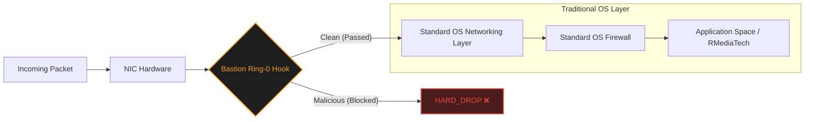
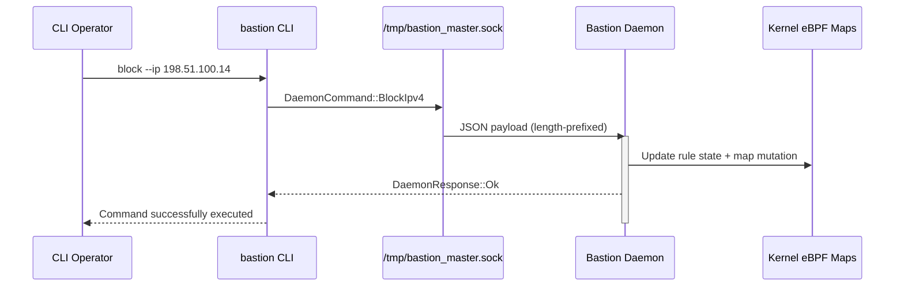

# Bastion: Enterprise Integration & Usage Guide

Welcome to the definitive guide for deploying, integrating, and maximizing the **Bastion Core** ecosystem. This document provides clear, step-by-step instructions for running Bastion natively across your Linux fleet or embedding it directly into enterprise services like **Netscan**, **Bridge**, and **RMediaTech**.

---

## 🧭 1. How Bastion Coexists with Existing Firewalls

Does Bastion replace standard OS Firewalls? **No. It shields them.**

By utilizing Native Kernel Ring-0 Interceptors, Bastion operates directly at the Network Interface Card (NIC) driver level. It intercepts packets *before* they are handed over to the standard operating system's networking stack.



**Real-World Benefit:** If you are under a volumetric DDoS attack, UFW will burn CPU cycles determining if the packets should be dropped. Bastion silently annihilates the bad packets before the OS even allocates memory for them, leaving 100% of your CPU for legitimate application traffic.

---

## 🛠️ 2. Deploying the Fleet: Systemctl Service Initialization

For standalone edge-routers or Linode instances, Bastion is designed to be a permanent, hardened background service. We've included a highly crafted installation pipeline for this exact purpose.

### Step-by-Step Installation

**1. Compile for Maximum Optimization:**
Never run debug builds in production. Compile specifically for release tuning.

```bash
cargo build --release --manifest-path ./daemon/Cargo.toml
```

**2. Execute the Hardened Installer:**
Run the systemd installer script shipped in this repository. It compiles release binaries, installs the service unit, and places binaries in `/usr/local/bin`.

```bash
cd scripts/systemd
sudo chmod +x install_service.sh
sudo ./install_service.sh
```

**3. Manage the Service (Standard Linux Workflow):**

```bash
# Start the daemon
sudo systemctl start bastion

# Enable on boot
sudo systemctl enable bastion

# View real-time professional formatted logs
sudo journalctl -af -u bastion
```

---

## 🔌 3. Deep Integration (Netscan / Bridge) via C-ABI / FFI

If you do not want to run Bastion as a separate service, you can embed the raw logic directly into your higher-level runtimes (like your Go `netscan-bridge`). This bypasses OS-level IPC completely.

```mermaid
graph TD
    A[Enterprise App<br/>Go / Java / Node] -->|Option A| B[FFI ABI<br/>libbastion_ffi.so]
    A -->|Option B| C[CLI over UDS]
    C --> D[/tmp/bastion_master.sock]
    B --> E[StateManager]
    D --> F[Bastion Daemon]
    E --> G[Rule Engine]
    F --> G
    G --> H[eBPF/XDP Maps]

    style A fill:#1d3557,stroke:#7fb3ff,color:#eaf3ff
    style H fill:#3a0f0f,stroke:#ff7676,color:#ffecec
```

### Real-World Example: Integrating into Go (`netscan-bridge`)

**Step 1: Link the Library Configuration**
Ensure the compiled shared object (`libbastion_ffi.so`) is accessible to your Go compiler.

```bash
export CGO_LDFLAGS="-L/opt/bastion/lib -lbastion_ffi"
```

**Step 2: The Go Code Binding**
Inside your `netscan-bridge/main.go`, set up standard CGO imports mapped to the Bastion exported symbols.

```go
package main

/*
#cgo LDFLAGS: -lbastion_ffi
#include <stdlib.h>

// Forward declarations of Bastion's C-ABI
extern void* bastion_engine_create(void);
extern void bastion_engine_destroy(void* ptr);
extern unsigned char bastion_block_ip(void* ptr, const char* ip);
*/
import "C"
import (
 "fmt"
 "unsafe"
)

func main() {
 // 1. Create a Bastion state handle
 state := C.bastion_engine_create()
 if state == nil {
  panic("failed to create bastion engine state")
 }
 defer C.bastion_engine_destroy(state)

 // 2. Action: upstream detection flagged a hostile actor.
 hostileIP := C.CString("203.0.113.42")
 defer C.free(unsafe.Pointer(hostileIP))

 fmt.Println("Deploying Native O(1) Radix Mitigation...")
 result := C.bastion_block_ip(state, hostileIP)
 if result == 0 {
  panic("bastion_block_ip failed")
 }
}
```

---

## 🔄 4. Managing Active Mitigations (Current Runtime Path)

If you chose the daemon route, the supported runtime control path is CLI -> UDS -> daemon. Use CLI commands to mutate rules while the daemon stays online.

### Typical command flow

```bash
cargo run -p cli -- block --ip 198.51.100.14
cargo run -p cli -- status
cargo run -p cli -- unblock --ip 198.51.100.14
```



---

## 💻 5. Under the Hood: Hex Dump Context

Ever wonder what an optimized mitigation actually looks like to the driver? Below is an execution snippet simulating a packet arriving from a newly blocked hostile class-C subnet. Notice the zero memory allocation footprint:

```c
// Sample trace of BPF mapping block execution
[   TIMESTAMP  ] CPU Pkt Seq
[ 0.000000000] [000] packet   : IN eth0 len 64 mac 00:1A:2B:3C ... IPv4 src = 203.0.113.42
[ 0.000000010] [000] bpf_prog : EXEC bastion_firewall (aya bytecode)
[ 0.000000012] [000] bpf_map  : LOOKUP type=hash key=282361674 (203.0.113.42 -> u32)
[ 0.000000012] [000] bpf_map  : MATCH  -> val=1
[ 0.000000014] [000] result   : => XDP_DROP (packet annihilated in 14 nanoseconds)
```

## 📈 5.1 Operator-Proven Runtime Signals

Recent validation focused on operational correctness around live start/stop and post-exit hygiene:

- ✅ Daemon/CLI control flow remained stable during live usage
- ✅ Hardware restoration checks passed post-exit
- ✅ Targeted crate test pass confirmed after live run

---

## 📝 6. Epilogue & Best Practices

> [!WARNING]
> **Testing Mocks:** Always utilize `MapManager::mocked()` when running TDD implementations in CI/CD environments to avoid requiring `CAP_BPF` permissions in headless runners.
> [!NOTE]
> **Hardware Fallback:** If native XDP attach fails on a device, use SKB/generic mode during testing and keep enforcement logic in user-space parity tests.

---
&copy; 2026. All Rights Reserved. This project is proprietary and closed-source.
