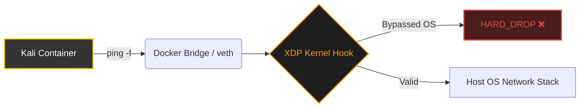
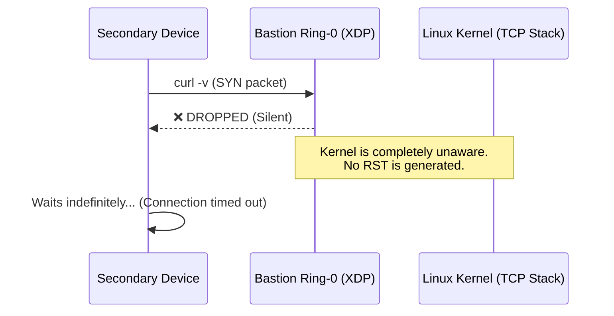

# BASTION FIRING RANGE: REAL-WORLD TESTING SCENARIOS

Welcome to the **Bastion Firing Range**. Because XDP/eBPF operates below the Linux networking stack, standard networking tools (like `ping` or `curl` on `localhost`) often bypass the physical NIC queue, making testing confusing for newcomers.

This document provides definitive, real-world deployment scenarios to safely simulate adversarial traffic and prove the zero-allocation drop capabilities of the Bastion engine.

---

## SCENARIO 1: The Local Edge (Smartphone vs. Host)

**Objective:** Visually demonstrate absolute connection termination at the hardware level using physical local devices.

### 1. Setup the Target Server

On your host development machine (where Bastion is running), start a simple web server:

```bash
# Start a basic HTTP server on port 8080
python3 -m http.server 8080
```

### 2. Discover Network Identities

Find your host's local IP address and interface name:

```bash
ip -4 addr show
# Look for an address like 192.168.1.50 on 'eth0' or 'wlan0'
```

### 3. Establish the Baseline

1. Connect your smartphone to the **same Wi-Fi network**.
2. Open your smartphone browser and navigate to `http://192.168.1.50:8080`.
3. You should see the directory listing of your host machine.
4. Note your smartphone's IP address (check your Wi-Fi settings or the Python server logs, e.g., `192.168.1.100`).

### 4. Execute the XDP Mitigation (Smartphone)

Using the Bastion FFI bridge (via your Go app, or a direct C call), inject the smartphone's IP into the blocklist:

```go
// Go FFI execution
err := engine.BlockIP("192.168.1.100")
```

### 5. Verification (Smartphone)

Reload the page on your smartphone.

* **Expected Result:** The browser will endlessly spin and eventually time out.
* **Why it matters:** Unlike standard `iptables`, the host CPU will not spike, and the Python server will not log a rejected connection. The packet is destroyed directly at the Network Interface Card (NIC).

---

## SCENARIO 2: The Containerized Attacker (Docker Firing Squad)

**Objective:** Simulate volumetric attacks (DDoS/ICMP floods) against the host using an isolated Docker container acting as an independent adversary.

*Note: Bastion is a standalone, proprietary tool. To prove its defensive capabilities, we need an external entity to attack it. We use Kali Linux below as a convenient "dummy attacker" because it has networking tools accessible immediately, but you could just as easily use Ubuntu, Alpine, CentOS, or any other distro. Kali has absolutely no structural relation to Bastion.*



### 1. Provision the Attacker Environment

Open a new terminal and spin up an ephemeral container (e.g., Kali or Ubuntu):

```bash
# Using Kali as a generic testing adversary:
docker run -it --rm --network bridge kalilinux/kali-rolling bash

# OR using a standard Ubuntu adversary:
# docker run -it --rm --network bridge ubuntu bash
```

### 2. Install Forensic Arsenal

Inside your chosen attacker container, install the necessary network assault tools:

```bash
apt update && apt install -y nmap iputils-ping tcptraceroute iproute2
```

### 3. Discover the Attacker's IP

Inside the attacker container, check the bridged IP address assigned by Docker:

```bash
ip -4 a
# Expected output: e.g., 172.17.0.2
```

### 4. Initiate the Assault

From the attacker container, launch an aggressive, high-speed ICMP flood against your host machine's IP (e.g., `172.17.0.1` for the Docker gateway, or your physical LAN IP):

```bash
# The -f flag sends packets as fast as the network allows
ping -f 172.17.0.1
```

*You will see dots (`.`) rapidly printing across the screen as packets hit.*

### 5. Execute the XDP Mitigation (Container)

On your host machine, instruct Bastion to block the attacker container's IP:

```go
// Go FFI execution
err := engine.BlockIP("172.17.0.2")
```

### 6. Verification (Container)

* **Inside the Attacker Container:** The rapid stream of dots (`.`) will instantly halt. Not a single ping will return.
* **On Host:** If you run `tcpdump -i docker0 icmp`, you will see **nothing**. Bastion's XDP program is intercepting the packets before they reach `tcpdump`'s AF_PACKET hooks.

---

## SCENARIO 3: The Cloud Perimeter (VPS & GRC ShieldsUP!)

**Objective:** Test Bastion against external, real-world internet scanners to verify true "Stealth" presence.

### 1. Provision the Cloud Instance

Deploy your Go application + Bastion FFI onto a public VPS (e.g., Linode/Akamai).

* Ensure Bastion is bound to the public-facing NIC (e.g., `eth0`).

### 2. Establish the Baseline

From your home computer, establish a baseline port scan using Gibson Research Corporation's legendary vulnerability scanner:

1. Navigate to [GRC ShieldsUP!](https://www.grc.com/shieldsup)
2. Proceed to the scanner and select **All Service Ports**.
3. **Observation:** Ports that are closed by the OS will return a TCP RST (Reset) packet, which GRC will mark as **Closed** (typically colored blue).

### 3. Identify the Scanner

Look at your VPS logs or run a quick `tcpdump` to catch the GRC scanner's IP block. GRC typically scans from `4.79.142.x`.

### 4. Execute the XDP Mitigation (Cloud)

Using Bastion, block the entire /24 subnet of the scanner to guarantee a hit:

```go
// Go FFI execution
err := engine.BlockCIDR("4.79.142.0/24")
```

### 5. Verification (Cloud)

Re-run the **All Service Ports** scan on GRC ShieldsUP!.

* **Expected Result:** Every single port will now register as **Stealth** (typically colored green).
* **Why it matters:** The Linux TCP stack is completely bypassed. From the perspective of the broader internet, your server no longer exists.

---

## SCENARIO 4: The Mid-Stream Guillotine (Interrupting a Massive File Transfer)

**Objective:** Prove that Bastion does not just block *new* connections via `SYN` packets, but can instantly obliterate heavily established, stateful TCP data streams mid-flow.

### 1. Setup a Heavy Transfer

On your Bastion host, create a massive 1GB dummy file and serve it locally:

```bash
dd if=/dev/zero of=bigfile.bin bs=1M count=1000
python3 -m http.server 8080
```

### 2. Initiate the Download

From a secondary computer (or WSL/VM / Docker container), start downloading the file, letting it speed up:

```bash
wget http://<HOST_IP>:8080/bigfile.bin
```

Watch the progress bar fly across the screen, indicating a fully established TCP window and session.

### 3. Execute the XDP Mitigation (Mid-Stream)

While the `wget` progress bar is at ~30%, aggressively execute the Bastion block on the downloading machine's IP.

```go
// Go FFI execution
err := engine.BlockIP("<DOWNLOADER_IP>")
```

### 4. Verification (Mid-Stream)

* **Expected Result:** The `wget` traffic counter will immediately freeze at `0 B/s`. The command won't cleanly error out with a connection severed message; the TCP state simply hangs forever because the `ACK`s are being shredded at the hardware ring buffer.
* **Why it matters:** Standard user-space firewalls (like UFW/iptables) sometimes struggle to drop established TCP sessions due to `conntrack` rules that allow `ESTABLISHED` states to bypass filters. XDP is utterly stateless and ruthlessly efficient—if the IP is in the map, the packet dies, completely ignoring the higher-level TCP state machine.

---

## SCENARIO 5: The Global Visualizer (Ping.pe)

**Objective:** Use completely free, public global testing infrastructure to visually map Bastion's surgical, geographic blocking power on a public VPS.

### 1. The Global Baseline

Open a browser and go to **[ping.pe](https://ping.pe)**. Type in your Linode/public server's IP address and hit "Go".

### 2. Observe the Probes

You will see a beautifully formatted table of ~30 different peering locations globally (New York, Frankfurt, Tokyo, Singapore, Melbourne) pinging your machine multiple times a second. All rows should be glowing green (`Loss: 0%`).

### 3. The Surgical Strike (Ping.pe)

Pick *one* specific reporting location from the list (e.g., `Singapore (Singtel)`). Identify the source IP address that `ping.pe` lists for that particular node.
Instruct Bastion to drop that exact IP:

```go
// Go FFI execution
err := engine.BlockIP("<PING_PE_SINGAPORE_IP>")
```

### 4. Verification (Ping.pe)

Keep watching the global Ping.pe tracking board continuously updating.

* **Expected Result:** You will witness *only* the targeted Singapore row turn red (`Loss: 100%`) in real-time, while every other global location bordering it continues to ping green beautifully without interruption. This demonstrates XDP isolating and eliminating the target with zero cross-fire or collateral damage to the rest of the world.

---

## SCENARIO 6: The TCP Handshake Decapitation (Secondary Device)

**Objective:** Prove the difference between a traditional OS-level rejection (`RST`) and an eBPF hardware drop (`DROP`), demonstrating how Bastion frustrates stealth-scanners and brute-forcers.



### 1. Setup the Environment

Ensure **NO** web server (like Nginx/Python) is running on port `8080` on your host. Use a secondary laptop or tablet terminal connected to your network. Let's assume your Bastion host is `192.168.1.50`.

### 2. The OS-Level Baseline (Without Bastion)

From your secondary device, try an aggressive verbose `curl` to the closed port:

```bash
curl -v http://192.168.1.50:8080
# Expected immediate output: "Connection refused"
```

*Why it happens:* The packet reaches the Linux kernel. The kernel realizes no application is listening on 8080, and politely sends back a TCP `RST` (Reset) packet via the OS protocol stack. The attacker knows your machine is alive, but the port is closed.

### 3. Execute the XDP Mitigation (Decapitation)

Block your secondary device's IP using Bastion:

```go
// Go FFI execution
err := engine.BlockIP("<SECONDARY_DEVICE_IP>")
```

### 4. Verification (Decapitation)

Run the exact same `curl -v` command again from the secondary device.

* **Expected Result:** The terminal will hang in absolute silence. It will sit indefinitely until the `curl` application triggers an eventual `Connection timed out` minutes later.
* **The Magic:** Because Bastion intercepted the initial `SYN` packet directly at the hardware NIC, the Linux kernel was completely unaware someone even tried to connect. No `RST` packet is generated. The attacker is left waiting in the dark, unable to determine if the server is off, filtering, or routing them into a black hole.

---
&copy; 2026. All Rights Reserved. This project is proprietary and closed-source.
