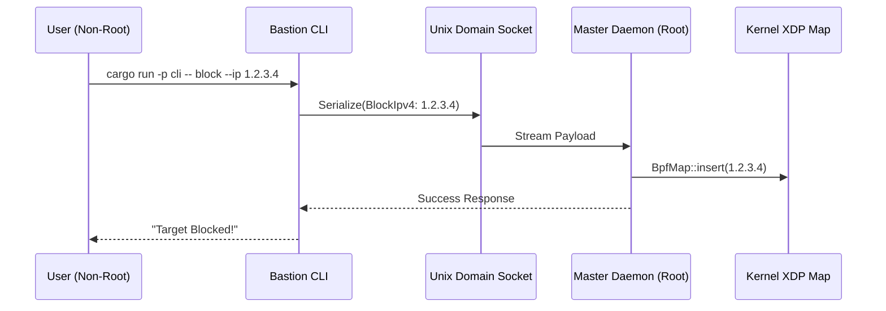
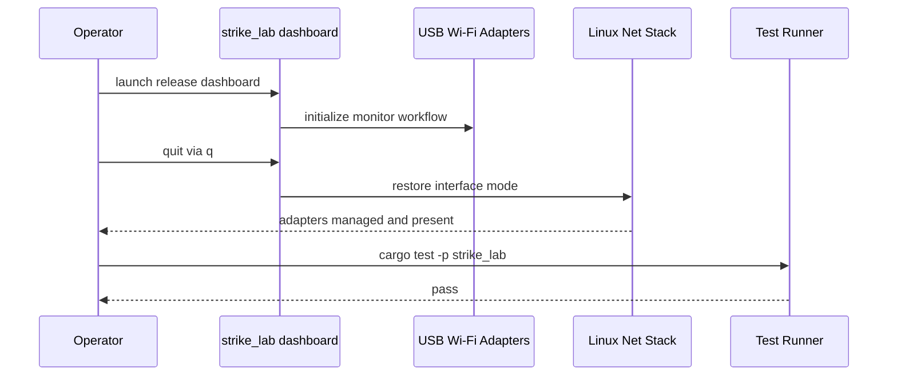

# Bastion: Local Execution & Operations Guide

Bastion relies on an advanced two-structure architecture: The **Master Daemon** (elevated operations) and the **CLI Frontend** (human-readable IPC interface). Because they are separated, they must be executed natively in detached parallel terminals.

This avoids monolithic bloat, maintaining secure, high-throughput capability natively.



## 🚀 Native Execution Using the Convenience Scripts

To save operators and developers time during rapid iterations or testing, we have created completely isolated and categorized execution scripts located within the `scripts/` directory.

### 1. Booting the Master Daemon

The `daemon` attaches strictly to the Linux kernel via deep ring-0 hooks. This requires `cargo` to run under the `root` user dynamically. We've built an auto-configuring shell script that catches invalid privilege executions perfectly.

*Open a primary terminal and run:*

```bash
./scripts/daemon/start_core_daemon.sh
```

**What to expect if you forget `sudo`:** You will receive a gracefully formatted, colorful, and highly actionable error pointing exactly to the fact that kernel network hooks require root privilege and will instruct you to append `sudo`.

*With root privileges:*

```bash
sudo ./scripts/daemon/start_core_daemon.sh
```

*Leave this terminal open. It will listen exclusively on the UNIX Domain Socket bindings.*

---

### 2. Operating the Features via CLI

The CLI does **not** need root permissions whatsoever. Use the daemon CLI wrapper script to dispatch commands over UDS.

*Open a completely separated secondary terminal and run commands through `scripts/daemon/cli.sh`:*

**Ping the Engine for Health Check:**

```bash
./scripts/daemon/cli.sh ping
```

**Execute the Telemetry & Drop-Counters:**

```bash
./scripts/daemon/cli.sh status
```

### Wrapper Preflight Checks

The wrapper layer now runs startup preflight checks before execution to reduce ambiguous runtime failures.

- `scripts/daemon/start_core_daemon.sh` runs daemon-mode preflight (workspace, cargo, root).
- `scripts/daemon/cli.sh` runs cli-mode preflight (workspace, cargo, cli crate availability).
- `scripts/daemon/policy_preset_smoke.sh` runs policy-smoke preflight and warns if daemon socket is missing.

You can invoke preflight directly:

```bash
./scripts/daemon/preflight.sh --mode daemon
./scripts/daemon/preflight.sh --mode cli
./scripts/daemon/preflight.sh --mode policy-smoke
```

## 🛠 Manual Bare-Metal Execution

If you wish to bypass the isolated `./scripts/` directories entirely and work directly with `cargo` for deep, raw testing:

1. **Fire the Daemon:**

   ```bash
   sudo cargo run -p bastion-daemon
   ```

2. **Execute Mitigations natively:**

   ```bash
   cargo run -p cli -- block --ip 192.168.1.50
   cargo run -p cli -- unblock --ip 192.168.1.50
   ```

### IPC Socket Details

The daemon and CLI default to `/tmp/bastion_master.sock`.

- Daemon creates the socket on startup.
- CLI uses this path by default.
- Override with `--socket` if you need a custom path.

## ⚠️ IDE Quirks: VS Code Multi-Root Workspaces

If you are developing Bastion inside a multi-root workspace (e.g., alongside `netscan`, `rmediatech`, etc.) and using the IDE's built-in "Run" button or Tasks interface, you might see confusing terminal prefixes such as:

```text
Executing task in folder netscan: cargo run --package utils --bin oui_lookup
```

**This is merely a cosmetic artifact of the VS Code task runner.** Because multiple projects are open, VS Code sometimes labels the execution terminal with the name of the first registered workspace folder.

**The Verification & The Fix:**
If you look closely at the cargo output (`Compiling utils v0.1.0 (/path/to/bastion/utils)`), it is correctly compiling and running Bastion's core, entirely decoupled from the legacy netscan project.

To avoid this visual confusion—and to properly pass required arguments (such as MAC addresses) to binaries that will otherwise fail with a `Usage:` error—always run sub-project binaries explicitly from your terminal:

```bash
cargo run -p utils --bin oui_lookup -- AA:BB:CC:DD:EE:FF
cargo run -p recon --bin os_detect -- 192.168.1.100
```

### 3. Persistent Systemd Background Operation

For persistent deployments (like remote proxy-boxes), you don't need to leave terminal windows running.

**Install the Daemon:**

```bash
sudo ./scripts/systemd/install_service.sh
```

If your sudo environment does not inherit Rust toolchain paths, use prebuild mode:

```bash
cargo build --release -p bastion-daemon -p cli
sudo BASTION_SKIP_BUILD=1 ./scripts/systemd/install_service.sh
```

The installer auto-detects a primary non-loopback interface and injects it into
the installed `bastion.service` `ExecStart` line to avoid brittle `eth0`
assumptions on modern distros.

**Uninstall the Daemon:**

```bash
sudo ./scripts/systemd/uninstall_service.sh
```

## Script Validation Matrix

| Script Area | Validation Type | Automation Status | Command |
| --- | --- | --- | --- |
| `scripts/**/*.sh` | Lint + formatting + syntax | Automated in CI | GitHub workflow: `Scripts Quality` |
| `scripts/daemon/*.sh` wrappers | Non-destructive behavior smoke | Automated local + CI | `bash scripts/tests/smoke_daemon_wrappers.sh` |
| `scripts/daemon/policy_preset_smoke.sh` | Functional daemon roundtrip smoke | Manual runtime smoke | `./scripts/daemon/policy_preset_smoke.sh --human` or `./scripts/daemon/policy_preset_smoke.sh --verbose` |
| `scripts/systemd/*.sh` privileged operations | Operational install/uninstall behavior | Manual validation (root required) | `sudo ./scripts/systemd/install_service.sh` |
| `scripts/clean_strike_lab_binaries.sh` | Personal-only safety guard | Automated in smoke harness | Guarded by `BASTION_PERSONAL_MODE=1` |

### Script QA Commands

```bash
# Run shell smoke harness
bash scripts/tests/smoke_daemon_wrappers.sh

# Syntax-check all shell scripts
find scripts -type f -name '*.sh' -print0 | xargs -0 -n1 bash -n
```

## Release Readiness Checklist (Operator Track)

Before shipping or tagging a release candidate, run:

```bash
# 1) Full workspace correctness
cargo test --workspace

# 2) Actionable shell lint gate
shellcheck -x -e SC1091 -f gcc $(find scripts -type f -name '*.sh' | sort)

# 3) Wrapper behavior gate
bash scripts/tests/smoke_daemon_wrappers.sh
```

All three commands must pass for Track 1 release acceptance.

For Track 3 public-beta readiness, pair the above gates with:

- `docs/SECURITY_MODEL.md`
- `docs/PRIVACY_AND_TELEMETRY.md`
- `docs/RELEASE_PACKAGING_CHECKLIST.md`

## Hardware-Conditional Degradation Playbook

Use this matrix when operating on hosts without full lab hardware or elevated privileges.

| Condition | Expected Behavior | Operator Action |
| --- | --- | --- |
| Daemon started without root | Wrapper preflight fails before runtime attach and prints actionable privilege guidance | Re-run with `sudo ./scripts/daemon/start_core_daemon.sh` |
| CLI used while daemon socket is absent | CLI path reports missing daemon/socket path instead of hanging | Start daemon first or pass explicit `--socket` path |
| `policy_preset_smoke.sh` used without running daemon | Preflight warns that socket is missing and exits non-zero | Launch daemon in primary terminal, then re-run smoke script |
| Host lacks monitor/injection-capable Wi-Fi adapter | Hardware-dependent live tests are skipped or fail with clear capability messaging | Continue with non-hardware release gates and record adapter gap |
| Live smoke env toggles are not enabled | Live tests marked `ignored` and do not fail baseline CI | Enable required env flags only for dedicated live validation sessions |

### Degradation-First Validation Sequence

When hardware or privileges are constrained, run this exact sequence to keep operations deterministic:

```bash
# 1) Validate script and wrapper guardrails
shellcheck -x -e SC1091 -f gcc $(find scripts -type f -name '*.sh' | sort)
bash scripts/tests/smoke_daemon_wrappers.sh

# 2) Validate full software correctness without live hardware assumptions
cargo test --workspace

# 3) Optionally validate hardware-conditional paths when lab gear is available
cargo test -p utils --features experimental-fuzz
```

This sequence is the default release-safe fallback when dedicated RF lab hardware is unavailable.

### Optional Live TCP Smoke Tests

The utils crate now includes an opt-in live TCP smoke harness for operator-approved targets.
It is ignored by default and only runs when explicitly armed:

```bash
BASTION_UTILS_ENABLE_LIVE=1 \
BASTION_UTILS_LIVE_TCP_TARGETS=192.168.1.10,192.168.1.11 \
BASTION_UTILS_LIVE_TCP_PORTS=22,80,443 \
cargo test -p utils live_tcp_scanner_smoke_explicit_targets -- --ignored --nocapture
```

Use the single-target variant only when you want to validate one host at a time:

```bash
BASTION_UTILS_ENABLE_LIVE=1 \
BASTION_UTILS_LIVE_TCP_SINGLE_TARGET=192.168.1.10 \
BASTION_UTILS_LIVE_TCP_SINGLE_PORTS=22,80,443 \
cargo test -p utils live_tcp_scanner_smoke_single_target -- --ignored --nocapture
```

Both tests are intentionally ignored by default so CI remains deterministic.

## 🧪 Verified Runtime Evidence (Recent Session)

The following checks were validated during a live Tier-1 smoke test with physical USB adapters:

- ✅ release `dashboard` binary launched and entered active scan path
- ✅ operator exit completed cleanly
- ✅ `iw dev` after exit showed both USB adapters back in `managed` mode
- ✅ `ip -brief link` confirmed interfaces remained sane post-exit
- ✅ `cargo test -p strike_lab` remained green after hardware run



---
&copy; 2026. All Rights Reserved. This project is proprietary and closed-source.
