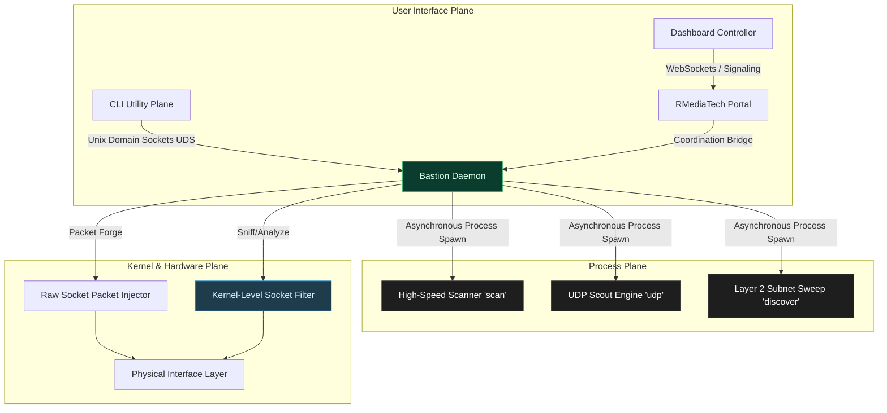

# Bastion: System Network Assessment & Interdiction Engine

Welcome to the **Bastion** documentation and architecture showcase repository. This repository serves as the public-facing architectural blueprint, topology mapping, and operational reference for the closed-source `bastion` project.

Bastion is a highly modular, enterprise-grade native compiled systems compiler network assessment and defense engine. It features zero-allocation binary parsing, asynchronous raw socket sniffing, and lock-free kernel-level packet filter hooks.

---

## 🏗️ System Architecture & Data Flow

Bastion is built as a capability-first background daemon paired with CLI controller planes and native library boundaries:



---

## 🧩 Workspace Crate Architecture

Bastion strictly adheres to Separation of Concerns via modular workspaces:

* **`daemon`**: The high-throughput background coordinator. Exposes local Unix Domain Sockets (UDS) and establishes dynamic secure coordinate links to the signaling mesh. It manages active sub-processes asynchronously using a thread-safe coordinator, allowing instantaneous process aborts.
* **`cli`**: The command-line control utility. Communicates with the background daemon over UDS to trigger operations and query subsystem status (`ping`, `status`, `block`, `unblock`).
* **`utils`**: The utility library containing CIDR engines, network-card self-awareness checks, and the high-speed port mapping engine (`scan`).
* **`forge`**: A zero-copy TCP/UDP raw packet factory with O(1) buffer allocation.
* **`recon`**: Active/passive service fingerprinting and passive wire-sniffing. Ingests TTL and Hop Limit metrics off the wire for zero-probe OS classification.
* **`strike`**: Active wireless interdiction and Deauth injection for supported radio adapters.
* **`ebpf` & `xdp`**: The raw kernel-level packet hook and shared maps layer, allowing high-performance traffic block and unblock controls directly in the network card driver path.
* **`ffi`**: The stable compatible native interface (`libbastion_ffi.so`), allowing foreign runtime integrations.

---

## 🛡️ Core Capabilities

### 1. Zero-Probe Passive OS Fingerprinting
By monitoring network interfaces passively, Bastion intercepts TCP syn-acks, matching IPv4 TTLs, window sizes, and IPv6 Hop Limits against operating system signature profiles. This allows it to classify network hosts without sending a single active probe.

### 2. Lock-Free Packet Mitigation (Kernel-Level Hooks)
Utilizes kernel-level instruction bytecode loaded directly into the network hook points. When the operator issues a block/unblock policy, the system updates a shared lock-free map, allowing packet drop evaluations to complete in nanoseconds at the driver level.

### 3. Non-Blocking Bidirectional Orchestration
The daemon maintains a persistent coordinate connection with the central dashboard, streaming structured CSV and JSON outputs in real-time. Command execution is delegated to spawned asynchronous readers, preventing the coordination connection from blocking during active sweeps.

---

## 🖥️ Expected CLI Outputs & Telemetry

Below are real-world expected stdout results collected during tactical operations on a local `/24` subnet testing against actual target hosts (e.g., standard Fios router gateway `192.168.1.1` and Linux-based laptops `192.168.1.160`):

### 1. Layer 2 Discovery Sweep (`discover`)
Performs high-speed active/passive ARP and NDP subnet mapping. When `--stdout` is supplied, it streams a raw summary of findings:

```bash
$ discover wlp0s20f3 --stdout --cidr 192.168.1.0/24
```

```text
[*] Initializing Fast L2 Discovery on interface: wlp0s20f3
  -> Source MAC: 58:CE:2A:3E:42:7F
  -> Source IPv4: 192.168.1.57
  -> Sweeping subnet: 192.168.1.0/24
  -> Source IPv6: 2600:4040:7cdc:1a00:59d4:c7d8:a36b:c686

[!] Draining Subnet Matrix (254 ARP / 254 NDP)...
[*] Broadcasting IPv6 ff02::1 Multicast Echo Request...
[*] Broadcasting active SSDP & mDNS multicast discovery queries...
[*] Raw packet drainage complete. Yielding for returns (3s)...

[+] Network convergence captured. Found 14 active hosts.
[+] Aggregated down to 14 distinct Layer 2 endpoints.

--- CSV REPORT ---
IP,MAC,Hostname
192.168.1.1,78:67:0E:BA:7E:74,_gateway
192.168.1.159,64:4E:D7:3B:72:5A,HP3B725A
192.168.1.160,04:EA:56:9D:4F:CC,xuaux
192.168.1.185,84:C8:A0:6D:A8:88,50Q550G
[+] Target sequence completed.
```

### 2. TCP Stealth SYN & Banner Scan (`scan`)
Scans host ports using raw half-open SYN packets (falling back to user-space Connect sockets when permissions aren't elevated) and initiates zero-allocation active fingerprinters on discovery:

```bash
# Scan custom target SSH port on local work laptop
$ scan 192.168.1.160 22,80,443,30778
```

```text
>> Engine initialized. Scanning 4 ports on 192.168.1.160 using Stealth SYN (auto-fallback) ...
============================================================
 🔥 TACTICAL SCAN RESULTS FOR 192.168.1.160
============================================================
 [+] PORT 30778 : OPEN ... [ SSH-2.0-OpenSSH_9.2p1 Linux-2+deb12u10 ]
============================================================
```

```bash
# Scan default TCP services on the subnet gateway router
$ scan 192.168.1.1 53,80,443
```

```text
>> Engine initialized. Scanning 3 ports on 192.168.1.1 using Stealth SYN (auto-fallback) ...
============================================================
 🔥 TACTICAL SCAN RESULTS FOR 192.168.1.1
============================================================
 [+] PORT 53    : OPEN ... [ DNS TCP Service ]
 [+] PORT 80    : OPEN ... [ HTTP/1.0 301 Moved Permanently ]
 [+] PORT 443   : OPEN ... [ Unknown (Raw: ) ]
============================================================
```

### 3. UDP Active Protocol Scouting (`udp`)
Verifies UDP listeners. Since UDP is connectionless, `--scout` actively fires NTP, SSDP, SNMP, and DNS signature payloads to verify response patterns:

```bash
$ udp 192.168.1.1 53,123,161,1900 --scout
```

```text
[*] Initializing UDP Tactical Scout on 192.168.1.1...
[*] Sending active protocol probes (DNS, NTP, SNMP, SSDP)...
============================================================
 🔥 UDP SCOUT RESULTS FOR 192.168.1.1
============================================================
 [+] PORT 53    : OPEN       ... [ DNS Responder ]
 [+] PORT 123   : OPEN       ... [ NTP Server Daemon ]
 [+] PORT 1900  : FILTERED   ... [ SSDP UPnP Advertisements ]
============================================================
```

---

## 🕶️ Operational Disclosure Model

Documentation in this repository emphasizes operational outcomes, interfaces, and architecture topologies over vendor-specific deployment details. Low-level internal structures are mapped only where required for platform compatibility.

---

## 📂 Extended Documentation Guides
For detailed engineering checklists, district integration protocols, and testing models, refer to:
*   [📖 Airspace Sentinel Plan](AIRSPACE_SENTINEL_PLAN.md): Wireless and RF scan deployment strategies.
*   [🧪 Firing Range Guide](FIRING_RANGE.md): Setup validation environments for intrusion testing.
*   [📐 Security Model](SECURITY_MODEL.md): Subsystem isolation guidelines.
*   [⚙️ Tactical Scanner Guide](TACTICAL_SCANNER_GUIDE.md): Stealth SYN and UDP scouting manuals.
*   [🛰️ Local Execution Guide](LOCAL_EXECUTION_GUIDE.md): Local host assessment reference.
*   [⚡ eBPF Compilation Guide](EBPF_COMPILATION_GUIDE.md): Linux Kernel eBPF/XDP compiler steps.

---

&copy; 2026. All Rights Reserved. This showcase documentation is open-source; the core implementation codebase is private and proprietary.
